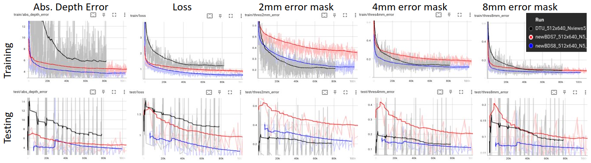
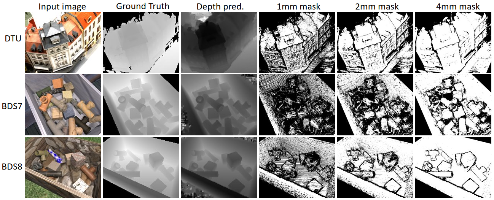
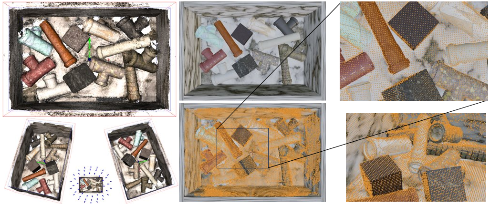
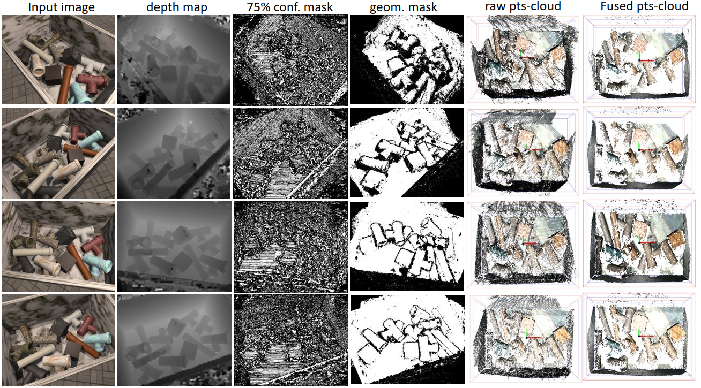
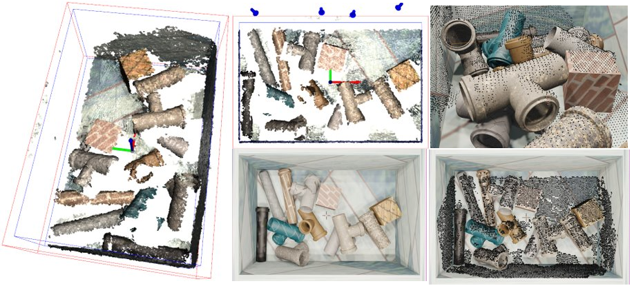
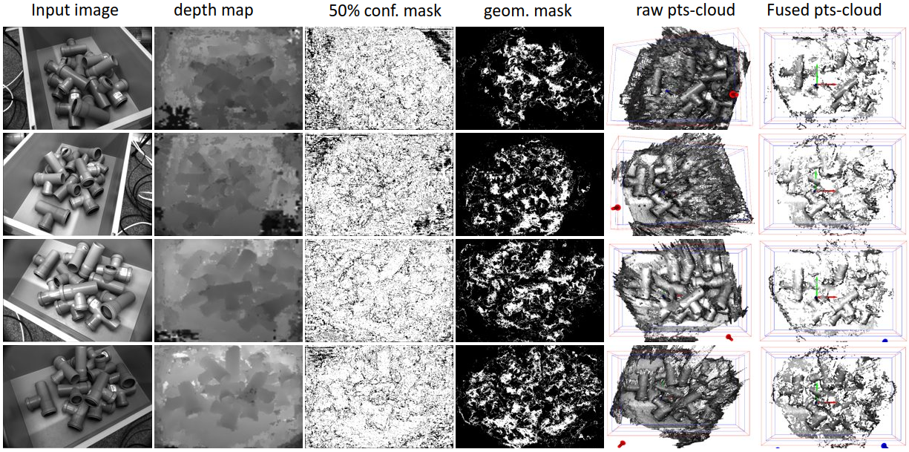
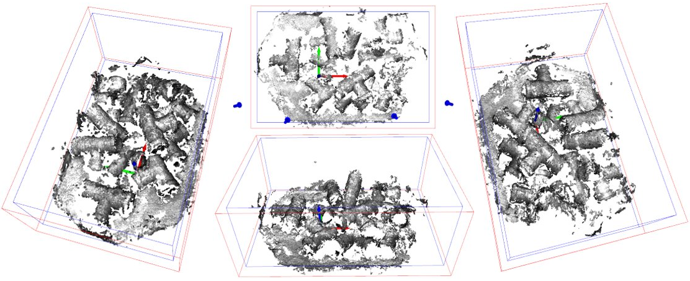

# 3D scene reconstruction using low cost cameras

This repository investigates the feasibility to use low-number of low-cost black & white cameras for of 3D scene reconstruction for bin-picking applications.

The core deep learning algorithm is based on MVSTER (2022).  


The following improvements were implemented:
- code quantization to reduce memory footprint
- set of debugging flags to plot intermediate features, depth maps and reconstructions
- Full control of evaluation parameters such as number of reconstruction views, number filters, number photometric and geometric masks, condition filtering, etc


## Requirements

- VScode
- python 3.8
- pytorch 2.0.1
- opend3D
- open-cv2
  
## Get started

- clone repository
- create a python 3.8 virtual environment and activate it
- install python libraries with "pip install -r requirements.txt"

## Train
- The synthesized images dataset used in this repo is not available for public download.
- Download the DTU dataset or create your own synthesized images dataset. 
- Edit and run any of the script files in the "script" folder.
- Monitor convergence using Tensorboard
```
tensorboard --bind_all --logdir <output_folder>
```

## Eval
- Create a folder named "output" and download model weights from the release section of the github folder.
- Inference on picture is done by selecting a VScode debugger configuration and running it.  
- Consult test_mvs4.py for information about input parameters:  
  - debug_model, debug_depth_gen, debug_depth_filter: allow to plot intermediate evaluation of features, depthmaps, reconstructions, etc
  - run_filter, NviewFilter, photomask, geomask, condmask_pixel, condmask_depth: allow to evaluate


## Demo


## Illustrations
### Convergence history and depthmap predictions during training


### Scene reconstruction from synthesized dataset using 49 cameras

### Scene reconstruction from synthesized dataset using only 4 low-cost cameras



### Scene reconstruction from real images using 4 low-cost cameras



## Acknowledgements

- [paper: "MVSTER: Epipolar Transformer for Efficient Multi-View Stereo, ECCV 2022](https://arxiv.org/abs/2204.07346)
- [code: github JeffWang987 MVSTER)](https://github.com/JeffWang987/MVSTER/)
- [Open-3D](https://www.open3d.org/docs/0.12.0/index.html)

